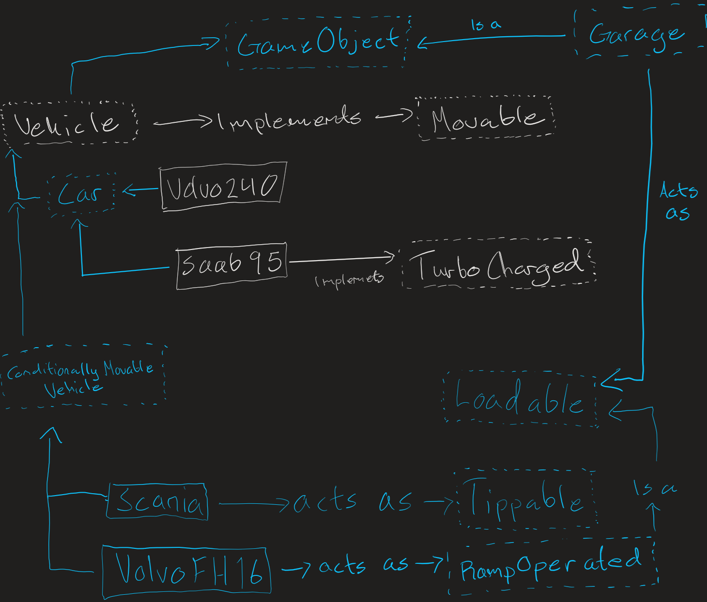

# oopd-gu-chalmers Lab 3
Lab assignment 3 in the course Object-oriented Programming and Design, GU/Chalmers

## Instruktioner för byggning
Från root-katalogen, skriv följande kommando.
```
mvn compile
```

## Instruktioner för körning
Från root-katalogen, skriv följande kommando.
```
mvn -pl :ui -am -Prun-ui validate
```

## Instruktioner för testning
Från root-katalogen, skriv följande kommando.
```
mvn clean verify
```

## Testresultat med coverage
[https://dukimy.github.io/LAB3/](https://dukimy.github.io/LAB3)

## Projekt struktur.
```
LAB3
│   .classpath
│   .gitignore
│   .gitmodules
│   .project
│   pom.xml
│   README.md
│   session.vim
│
├───.github
│   └───workflows
│           yacoco-pages.yml
│
├───.settings
│       org.eclipse.core.resources.prefs
│       org.eclipse.jdt.apt.core.prefs
│       org.eclipse.jdt.core.prefs
│       org.eclipse.m2e.core.prefs
│
├───.vscode
│       settings.json
│
├───img
│       Sketch.png
│
├───model
│   │   pom.xml
│   │
│   ├───src
│   │   ├───main
│   │   │   └───java
│   │   │       └───lab3
│   │   │           │   ConditionallyMovableVehicle.java
│   │   │           │   GameObject.java
│   │   │           │   Garage.java
│   │   │           │   README.md
│   │   │           │   Saab95.java
│   │   │           │   Scania.java
│   │   │           │   Vehicle.java
│   │   │           │   Volvo240.java
│   │   │           │   VolvoFH16.java
│   │   │           │
│   │   │           └───interfaces
│   │   │                   Car.java
│   │   │                   Loadable.java
│   │   │                   Movable.java
│   │   │                   RampOperated.java
│   │   │                   Tippable.java
│   │   │                   TurboChargable.java
│   │   │
│   │   └───test
│   │       └───java
│   │           └───lab3
│   │                   GarageTests.java
│   │                   LoadableVehicleTests.java
│   │                   TippableVehiclesTest.java
│   │                   VehicleTests.java
│   │
│   └───target
│       │   jacoco.exec
│       │   model-1.0-SNAPSHOT.jar
│       │
│       ├───classes
│       │   └───lab3
│       │       │   ConditionallyMovableVehicle.class
│       │       │   GameObject.class
│       │       │   Garage.class
│       │       │   README.md
│       │       │   Saab95.class
│       │       │   Scania.class
│       │       │   Vehicle.class
│       │       │   Volvo240.class
│       │       │   VolvoFH16.class
│       │       │
│       │       └───interfaces
│       │               Car.class
│       │               Loadable.class
│       │               Movable.class
│       │               RampOperated.class
│       │               Tippable.class
│       │               TurboChargable.class
│       │
│       ├───generated-sources
│       │   └───annotations
│       ├───generated-test-sources
│       │   └───test-annotations
│       ├───maven-archiver
│       │       pom.properties
│       │
│       ├───maven-status
│       │   └───maven-compiler-plugin
│       │       ├───compile
│       │       │   └───default-compile
│       │       │           createdFiles.lst
│       │       │           inputFiles.lst
│       │       │
│       │       └───testCompile
│       │           └───default-testCompile
│       │                   createdFiles.lst
│       │                   inputFiles.lst
│       │
│       ├───site
│       │   └───jacoco
│       │       │   index.html
│       │       │   jacoco-sessions.html
│       │       │   jacoco.csv
│       │       │   jacoco.xml
│       │       │
│       │       ├───jacoco-resources
│       │       │       branchfc.gif
│       │       │       branchnc.gif
│       │       │       branchpc.gif
│       │       │       bundle.gif
│       │       │       class.gif
│       │       │       down.gif
│       │       │       greenbar.gif
│       │       │       group.gif
│       │       │       method.gif
│       │       │       package.gif
│       │       │       prettify.css
│       │       │       prettify.js
│       │       │       redbar.gif
│       │       │       report.css
│       │       │       report.gif
│       │       │       session.gif
│       │       │       sort.gif
│       │       │       sort.js
│       │       │       source.gif
│       │       │       up.gif
│       │       │
│       │       └───lab3
│       │               ConditionallyMovableVehicle.html
│       │               ConditionallyMovableVehicle.java.html
│       │               GameObject.html
│       │               GameObject.java.html
│       │               Garage.html
│       │               Garage.java.html
│       │               index.html
│       │               index.source.html
│       │               Saab95.html
│       │               Saab95.java.html
│       │               Scania.html
│       │               Scania.java.html
│       │               Vehicle.html
│       │               Vehicle.java.html
│       │               Volvo240.html
│       │               Volvo240.java.html
│       │               VolvoFH16.html
│       │               VolvoFH16.java.html
│       │
│       ├───surefire-reports
│       │       lab3.GarageTests.txt
│       │       lab3.LoadableVehicleTests.txt
│       │       lab3.TippableVehiclesTest.txt
│       │       lab3.VehicleTest.txt
│       │       TEST-lab3.GarageTests.xml
│       │       TEST-lab3.LoadableVehicleTests.xml
│       │       TEST-lab3.TippableVehiclesTest.xml
│       │       TEST-lab3.VehicleTest.xml
│       │
│       └───test-classes
│           └───lab3
│                   GarageTests.class
│                   LoadableVehicleTests.class
│                   TippableVehiclesTest.class
│                   VehicleTest.class
│
└───ui
    │   .gitignore
    │   pom.xml
    │   README.md
    │
    ├───src
    │   └───main
    │       ├───java
    │       │   └───lab3
    │       │       └───ui
    │       │               CarController.java
    │       │               CarView.java
    │       │               DrawPanel.java
    │       │
    │       └───resources
    │           └───pics
    │                   Saab95.jpg
    │                   Scania.jpg
    │                   Volvo240.jpg
    │                   VolvoBrand.jpg
    │
    └───target
        │   ui-1.0-SNAPSHOT.jar
        │
        ├───classes
        │   ├───lab3
        │   │   └───ui
        │   │           CarController$TimerListener.class
        │   │           CarController.class
        │   │           CarView$1.class
        │   │           CarView$2.class
        │   │           CarView.class
        │   │           DrawPanel.class
        │   │
        │   └───pics
        │           Saab95.jpg
        │           Scania.jpg
        │           Volvo240.jpg
        │           VolvoBrand.jpg
        │
        ├───generated-sources
        │   └───annotations
        ├───maven-archiver
        │       pom.properties
        │
        ├───maven-status
        │   └───maven-compiler-plugin
        │       └───compile
        │           └───default-compile
        │                   createdFiles.lst
        │                   inputFiles.lst
        │
        └───test-classes
```

## Dokumentation av planeringsstadiet.


