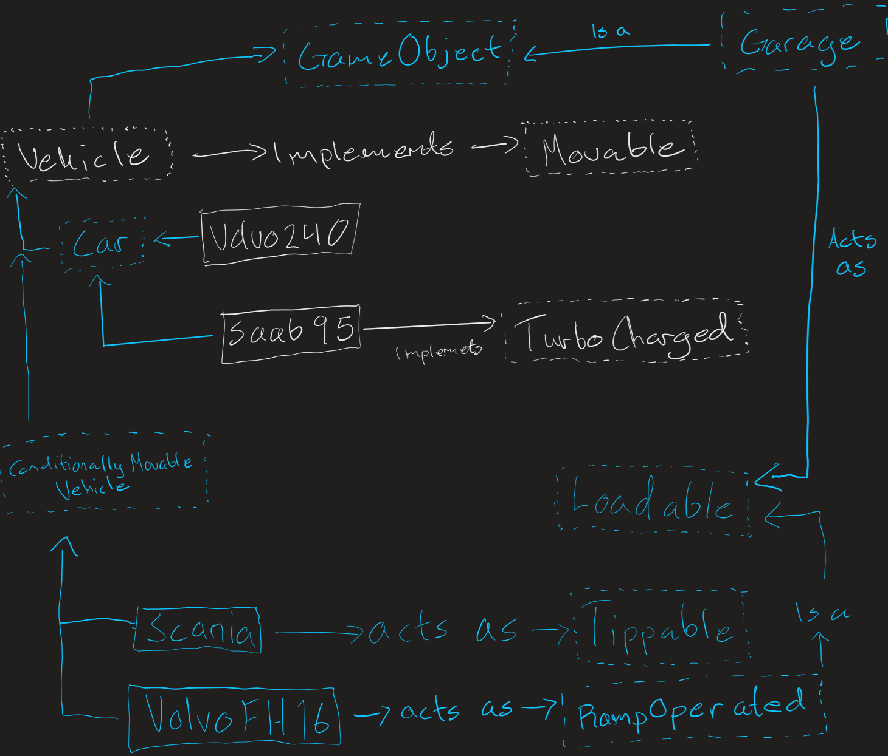

# oopd-gu-chalmers Lab 4
Lab assignment 4 in the course Object-oriented Programming and Design, GU/Chalmers

## Instruktioner för omkompilering.
```mvn clean verify```

## Instruktioner för körning.
```mvn -pl app -am package -Prun```

## Testresultat med coverage
[https://dukimy.github.io/LAB4/](https://dukimy.github.io/LAB4)

## Projekt struktur.
```
LAB4
│   .classpath
│   .gitignore
│   .gitmodules
│   .project
│   pom.xml
│   README.md
│   session.vim
│
├───.github
│   ├───img
│   │       Sketch.png
│   │
│   └───workflows
│           yacoco-pages.yml
│
├───.settings
│       org.eclipse.core.resources.prefs
│       org.eclipse.jdt.apt.core.prefs
│       org.eclipse.jdt.core.prefs
│       org.eclipse.m2e.core.prefs
│
├───.vscode
│       settings.json
│
├───app
│   │   pom.xml
│   │
│   ├───src
│   │   └───main
│   │       └───java
│   │           └───lab4
│   │               └───app
│   │                       App.java
│   │                       CarController.java
│   │                       WorldSnapshotPublisher.java
│   │
│   └───target
│       │   app-1.0-SNAPSHOT.jar
│       │
│       ├───classes
│       │   └───lab4
│       │       └───app
│       │               App.class
│       │               CarController$1.class
│       │               CarController$10.class
│       │               CarController$11.class
│       │               CarController$12.class
│       │               CarController$2.class
│       │               CarController$3.class
│       │               CarController$4.class
│       │               CarController$5.class
│       │               CarController$6.class
│       │               CarController$7.class
│       │               CarController$8.class
│       │               CarController$9.class
│       │               CarController.class
│       │               WorldSnapshotPublisher.class
│       │
│       ├───generated-sources
│       │   └───annotations
│       ├───maven-archiver
│       │       pom.properties
│       │
│       └───maven-status
│           └───maven-compiler-plugin
│               └───compile
│                   └───default-compile
│                           createdFiles.lst
│                           inputFiles.lst
│
├───model
│   │   pom.xml
│   │
│   ├───src
│   │   ├───main
│   │   │   └───java
│   │   │       └───lab4
│   │   │           └───model
│   │   │               │   ConditionallyMovableVehicle.java
│   │   │               │   GameObject.java
│   │   │               │   Garage.java
│   │   │               │   RandomVehicleFactory.java
│   │   │               │   README.md
│   │   │               │   Saab95.java
│   │   │               │   Scania.java
│   │   │               │   Vehicle.java
│   │   │               │   Volvo240.java
│   │   │               │   VolvoFH16.java
│   │   │               │   World.java
│   │   │               │   WorldListener.java
│   │   │               │
│   │   │               └───interfaces
│   │   │                       Car.java
│   │   │                       Loadable.java
│   │   │                       Movable.java
│   │   │                       RampOperated.java
│   │   │                       Tippable.java
│   │   │                       TurboChargable.java
│   │   │                       VehicleFactory.java
│   │   │                       WorldView.java
│   │   │
│   │   └───test
│   │       └───java
│   │           └───lab4
│   │                   GarageTests.java
│   │                   LoadableVehicleTests.java
│   │                   TippableVehiclesTest.java
│   │                   VehicleTests.java
│   │
│   └───target
│       │   jacoco.exec
│       │   model-1.0-SNAPSHOT.jar
│       │
│       ├───classes
│       │   └───lab4
│       │       └───model
│       │           │   ConditionallyMovableVehicle.class
│       │           │   GameObject.class
│       │           │   Garage.class
│       │           │   RandomVehicleFactory.class
│       │           │   Saab95.class
│       │           │   Scania.class
│       │           │   Vehicle.class
│       │           │   Volvo240.class
│       │           │   VolvoFH16.class
│       │           │   World.class
│       │           │   WorldListener.class
│       │           │
│       │           └───interfaces
│       │                   Car.class
│       │                   Loadable.class
│       │                   Movable.class
│       │                   RampOperated.class
│       │                   Tippable.class
│       │                   TurboChargable.class
│       │                   VehicleFactory.class
│       │                   WorldView.class
│       │
│       ├───generated-sources
│       │   └───annotations
│       ├───generated-test-sources
│       │   └───test-annotations
│       ├───maven-archiver
│       │       pom.properties
│       │
│       ├───maven-status
│       │   └───maven-compiler-plugin
│       │       ├───compile
│       │       │   └───default-compile
│       │       │           createdFiles.lst
│       │       │           inputFiles.lst
│       │       │
│       │       └───testCompile
│       │           └───default-testCompile
│       │                   createdFiles.lst
│       │                   inputFiles.lst
│       │
│       ├───surefire-reports
│       │       lab4.GarageTests.txt
│       │       lab4.LoadableVehicleTests.txt
│       │       lab4.TippableVehiclesTest.txt
│       │       lab4.VehicleTest.txt
│       │       TEST-lab4.GarageTests.xml
│       │       TEST-lab4.LoadableVehicleTests.xml
│       │       TEST-lab4.TippableVehiclesTest.xml
│       │       TEST-lab4.VehicleTest.xml
│       │
│       └───test-classes
│           └───lab4
│                   GarageTests.class
│                   LoadableVehicleTests.class
│                   TippableVehiclesTest.class
│                   VehicleTest.class
│
└───ui
    │   .gitignore
    │   pom.xml
    │   README.md
    │
    ├───src
    │   └───main
    │       ├───java
    │       │   └───lab4
    │       │       └───ui
    │       │           │   Canvas.java
    │       │           │   Frame.java
    │       │           │   LogPanel.java
    │       │           │   RootContainer.java
    │       │           │   Toolbar.java
    │       │           │
    │       │           └───render
    │       │                   GarageSnapshot.java
    │       │                   SnapshotListener.java
    │       │                   SpriteStore.java
    │       │                   VehicleSnapshot.java
    │       │                   WorldSnapshot.java
    │       │
    │       └───resources
    │           └───pics
    │                   Saab95.jpg
    │                   Scania.jpg
    │                   Volvo240.jpg
    │                   VolvoBrand.jpg
    │                   VolvoFH16.png
    │
    └───target
        │   ui-1.0-SNAPSHOT.jar
        │
        ├───classes
        │   ├───lab4
        │   │   └───ui
        │   │       │   Canvas.class
        │   │       │   Frame.class
        │   │       │   RootContainer.class
        │   │       │   Toolbar.class
        │   │       │
        │   │       └───render
        │   │               GarageSnapshot.class
        │   │               SnapshotListener.class
        │   │               SpriteStore.class
        │   │               VehicleSnapshot.class
        │   │               WorldSnapshot.class
        │   │
        │   └───pics
        │           Saab95.jpg
        │           Scania.jpg
        │           Volvo240.jpg
        │           VolvoBrand.jpg
        │           VolvoFH16.png
        │
        ├───generated-sources
        │   └───annotations
        ├───maven-archiver
        │       pom.properties
        │
        └───maven-status
            └───maven-compiler-plugin
                └───compile
                    └───default-compile
                            createdFiles.lst
                            inputFiles.lst
```

## Dokumentation av planeringsstadiet.


